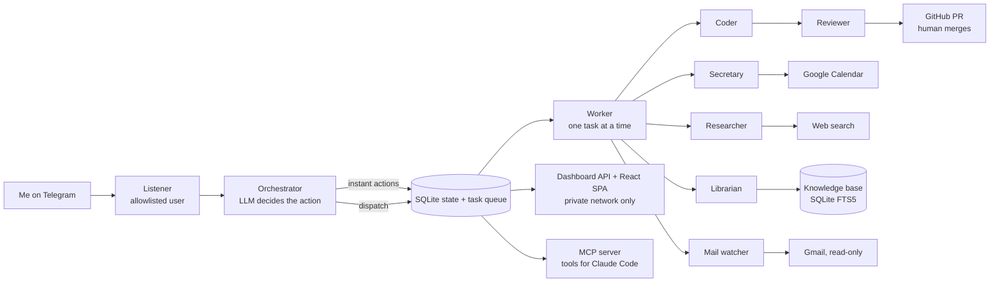

# Always-On AI Agent Platform

A personal AI assistant I built and used daily from June to August 2026. I message it on Telegram in plain English, and an LLM orchestrator sends each request to the right specialist agent: calendar, to-dos and habits, journaling, web research and news, email, expenses, a personal knowledge base, or a **coding agent that opens GitHub pull requests for me**. A React dashboard shows everything in one place.

<!-- Demo: add a GIF or short video here (Telegram request → PR opened → dashboard) -->

## Architecture at a glance



## Design decisions worth a look

- **Humans stay in control of anything risky.** Every coding task starts in read-only plan mode and triages itself. Trivial changes go ahead; complex ones come back as a step-by-step plan and wait for my approval. A separate reviewer agent checks each change before the PR opens, and the agent never merges. Calendar writes and deletions are proposed first and wait for a yes. See [ADR-0004](docs/adr/0004-code-review-as-a-role.md) and [ADR-0006](docs/adr/0006-long-horizon-coder.md).
- **The listener never blocks.** Telegram polling, the LLM "brain" and the worker run separately around a SQLite task queue, so a long coding job doesn't stop me chatting. See [docs/architecture.md](docs/architecture.md).
- **Built for a 1 GB VM.** Search over my notes uses SQLite full-text search instead of an embedding model, so nothing heavy stays in memory ([ADR-0003](docs/adr/0003-personal-knowledge-base-fts5.md)). When memory got tight, I resized the VM instead of cutting features ([ADR-0011](docs/adr/0011-vm-resize-e2-medium.md)).
- **Least-privilege credentials.** It uses short-lived GitHub App tokens instead of a personal access token, read-only Gmail and Drive scopes, and a single env loader that strips unintended API keys.
- **Operable by one person.** It runs as a systemd service on a GCP VM and deploys itself: a timer pulls from GitHub every 2 minutes. There's a setup wizard that checks every credential against the real service, and a laptop staging mode ([ADR-0009](docs/adr/0009-laptop-staging-and-clone-ready-setup.md)).
- **Decisions are documented.** 15 architecture decision records live in [docs/adr](docs/adr).

**Stack:** Python, Claude Code CLI (headless), Telegram Bot API, SQLite (FTS5), Google Calendar/Sheets/Gmail/Drive APIs, GitHub App API, MCP, React + TypeScript (Vite), systemd, GCP Compute Engine, Tailscale.

© 2026 Bryan Marlon Haryono. All rights reserved. The code is published for viewing as a portfolio project. Please ask before reusing it.

---

## Technical overview


A personal, always-on agent driven over Telegram. An LLM **orchestrator**
interprets each message and dispatches specialized roles: a **coder** that
turns plain-English requests into GitHub pull requests (self-reviewed before
opening; a human merges — it never merges on its own), a **reviewer** for any
existing PR, an **explainer** that briefs you on PRs and codebases, a
**secretary** for Google Calendar (every write confirmed first), a
**researcher** and **news** digest via live web search, a **finance** reader,
a Gmail **mail** watcher, a **psychologist** that knows you over time, a
**librarian** over your personal knowledge base, and a LifeOS layer (todos,
habits, CRM, journaling) with scheduled daily and weekly digests. A background
**worker** runs dispatched tasks one at a time so the listener never blocks.

The intelligence is remote: the agent shells out to the **Claude Code CLI**
(`claude -p`) authenticated with a **Claude Max** token. This box runs no local
model inference — it's a lightweight orchestration client. No GPU needed.

## How the pieces fit

| File | Role |
|------|------|
| `telegram_listener.py` | Entry point. Polls Telegram, allowlists one user, enqueues messages for a brain thread (so decide() never blocks the poll), starts the worker thread. |
| `orchestrator.py` | The "brain." One `claude -p` call decides what a message means (reply / dispatch / schedule / set fact) and enqueues it. Also stores message history + pinned facts + a rolling summary of messages that age out of the recent window. |
| `worker.py` | Background loop. Pulls queued tasks one at a time and runs the right worker, then sends the result back. |
| `coding_agent.py` | Coder. Plans (read-only) → triages trivial vs complex → edits files via Claude Code → self-review gate → Python commits/pushes and opens the PR. |
| `reviewer.py` | Code review as a role: reviews any existing GitHub PR on demand and provides the coder's pre-PR self-review. Advisory only — never merges ([ADR-0004](docs/adr/0004-code-review-as-a-role.md)). |
| `secretary.py` | Calendar. Executes structured ops (create/list/move/cancel); move/cancel act only on an exact single match. |
| `researcher.py` | Web. Live web search answers + the news digest, via headless Claude Code with its built-in WebSearch/WebFetch tools — no scraping stack. |
| `librarian.py` | Personal knowledge base. Search/ask over your own files (saved notes, uploaded documents/PDFs) on disk under `~/knowledge`, indexed with SQLite FTS5 — no embeddings ([ADR-0003](docs/adr/0003-personal-knowledge-base-fts5.md)). Listed/deleted from the chat via instant actions (delete confirms first). |
| `explainer.py` | Explainer. Briefs you on a PR (what/why/how, where to look hardest) before you review it, or walks you through how something works in a codebase — read-only plan-mode `claude -p` over a shallow checkout ([ADR-0008](docs/adr/0008-explainer-role.md)). |
| `lifeos.py` | Personal OS. Todos/habits/CRM (in `agent.db`), journaling through [journey](https://github.com/Arkhamedes/journey)'s `jcore` (`JOURNEY_DIR`), Groq voice transcription, and the scheduler that sends morning key-tasks, evening check-in, and Sunday strategic-review digests. |
| `finance.py` | Finance Pulse. Reads label/value rows from your finance Google Sheet's `Summary` tab (read-only scope); sheet URL remembered as the `finance_sheet` fact. |
| `psychologist.py` | Knows you over time (rolling profile updated from journals + weekly stats). On-demand check-ins ("how am I doing?") and the merged Sunday weekly review. |
| `mailwatch.py` | Gmail, read-only: on-demand search plus standing watches whose new matches ride the morning/evening digests. |
| `mcp_server.py` | MCP server: knowledge base, calendar, and todos/habits as typed tools inside Claude Code sessions on the box — see [docs/subsystems/mcp.md](docs/subsystems/mcp.md). |
| `dashboard.py` | Alfred dashboard backend: JSON API (`/api/state` + write endpoints) and static host for the `frontend/` SPA, on 127.0.0.1:8766, tailnet-only via `tailscale serve --https=8443`. |
| `frontend/` | Interactive dashboard SPA (Vite + React + TS): Kanban drag, check-offs, habit ticks, CRM updates. Built off-box; `dist/` ships as static files — see `frontend/README.md`. |
| `task_store.py` | SQLite task queue + state (`agent.db`). |
| `agentlog.py` | Timestamped logging + a `timed()` bracket (a `-- start` with no `-- done` is the alarm signal). |
| `setup.py` | Interactive first-run wizard: validates each credential against the real service as you type it, writes `agent_env.sh` ([ADR-0009](docs/adr/0009-laptop-staging-and-clone-ready-setup.md)). |
| `stage.py` | Laptop staging driver — the full orchestrator/worker path, no Telegram, disposable `staging.db` ([docs/staging.md](docs/staging.md)). |
| `envfile.py` | The one env-file loader; always drops `ANTHROPIC_API_KEY`. |
| `github_app.py` | GitHub App token plumbing shared by coder / reviewer / journal backup — no PAT on the box. |
| `persona.py` | Optional `AGENT_PERSONA` voice for user-facing replies (tone only, never structure or facts). |
| `run_listener.sh` | Portable launcher (loads secrets, fixes PATH, runs unbuffered). |
| `run_remote_control.sh` + `deploy/remote-control.service` | Phone-first sessions: keeps a `claude remote-control` server up so the claude.ai app creates sessions on the box. |
| `bin/k.sh` | Optional (not the service): `k`/`kgo`/`kc`/`kcn` helpers to SSH in and drive an interactive `claude` in tmux — see [gcp_setup_guide.md](docs/extras/gcp_setup_guide.md) §8–9. |
| `deploy/agent.service` | systemd unit — the always-on mechanism. |
| `deploy/autodeploy.{sh,service,timer}` | Pull-based CI: a 2-min timer on the VM self-updates from GitHub (and pip-installs when `requirements.txt` changes). |
| `test/` | One-time setup checks: GitHub App/git plumbing and Google auth. |

## Prerequisites

- Linux (x86-64 or ARM64), Python 3.10+
- **Node.js + Claude Code CLI**, authenticated: `claude setup-token`
- `git`, and a **GitHub App** (App ID + private key) with `contents:write` and
  `pull_requests:write` on the target repo — plus `checks:read` for the
  coder's post-PR CI status line (ADR-0006; without it the line degrades to
  a pointer), and optionally `workflows:write` if the coder should ever
  create/update `.github/workflows/*` files
- A **Google Cloud OAuth client** + an authorized `token.json` (see below)

## Setup

> Hosting on Google Cloud's free tier? [gcp_setup_guide.md](docs/extras/gcp_setup_guide.md)
> covers provisioning the VM (and its 1 GB RAM workaround) before these steps.

```bash
git clone <your-repo-url> autonomous-agent
cd autonomous-agent

python3 -m venv venv
./venv/bin/pip install -r requirements.txt

./venv/bin/python setup.py
```

`setup.py` is an interactive wizard: it walks through every credential
(BotFather bot, GitHub App, Claude Max token, optional Groq, persona),
**validates each one against the real service as you enter it**, and writes
`agent_env.sh` (chmod 600). Its first question picks the profile: the full
Telegram instance, or the **minimal client instance** (Claude Code as the
interface — see
[client-vm-deploy-key-setup.md](docs/extras/client-vm-deploy-key-setup.md)),
which skips Telegram/GitHub App entirely. To try the wizard without touching an existing
instance's `agent_env.sh`, run these same steps in a throwaway clone
(`git clone` into a scratch dir, venv, `pip install`, `setup.py`) and delete
it after. Prefer doing it by hand? The manual path still works:

```bash
cp agent_env.sh.example agent_env.sh && chmod 600 agent_env.sh
# ...fill in agent_env.sh with real values...
```

**Google Calendar token:** authorize once on a machine with a browser
(`test/gcal_smoke_test.py` performs the loopback OAuth flow), then copy the
resulting `token.json` into the repo dir. It holds a refresh token, so the box
never needs a browser. Requires the Google project to be published "In
production" (Testing-mode refresh tokens expire after 7 days).

**Verify integrations before going live:**
```bash
source agent_env.sh
./venv/bin/python test/smoke_test.py         # GitHub App + git push/PR
./venv/bin/python test/gcal_smoke_test.py    # Google Calendar auth
```

**Test changes before they deploy themselves:** a laptop checkout doubles as
staging — `stage.py` drives the full orchestrator/worker path with no
Telegram bot and its own `staging.db`. See [docs/staging.md](docs/staging.md).

**Claude Code sessions get the agent's tools too:** the repo's `.mcp.json`
spawns `mcp_server.py`, exposing knowledge base, calendar, and todos/habits
as MCP tools inside any session opened in this directory (reads promptless,
writes permission-prompted). See [docs/subsystems/mcp.md](docs/subsystems/mcp.md).

## Run

Point `run_listener.sh` at your `claude` binary (edit the PATH line — find it
with `which claude`), then install the service:

```bash
# edit User= and the two paths in deploy/agent.service first
sudo cp deploy/agent.service /etc/systemd/system/agent.service
sudo systemctl daemon-reload
sudo systemctl enable --now agent
```

`Restart=always` + `WantedBy=multi-user.target` give the two things that make it
"always-on": auto-restart on crash, and auto-start on boot.

**Optional — phone-first Claude Code sessions:** `deploy/remote-control.service`
keeps a `claude remote-control` server running so the **claude.ai app creates
sessions on this machine directly** (no SSH per session; each gets the MCP
tools). One-time full-scope `/login` first — the `setup-token` credential is
inference-only and can't do remote control. Install steps in the unit's
header; full walkthrough in
[docs/extras/gcp_setup_guide.md](docs/extras/gcp_setup_guide.md) §8.

## Watch it

```bash
tail -f agent.log            # or: journalctl -u agent -f
```

Reading the log: a long-but-healthy build can run ~2–3 minutes, and queued tasks
wait their turn — both are normal. The real alarm is a `claude [...] -- start`
with **no matching `-- done` for more than ~10 minutes**.

## Notes

- **Never** set `ANTHROPIC_API_KEY` — it overrides the Max OAuth token and bills
  at metered API rates. `run_listener.sh` unsets it defensively.
- Secrets, `agent.db`, `token.json`, `*.pem`, and logs are gitignored — they
  live on the machine, never in the repo.
- Path defaults (`agent.db`, `token.json`) resolve next to the code; override
  with `AGENT_DB_PATH` / `GCAL_TOKEN` if you want them elsewhere.