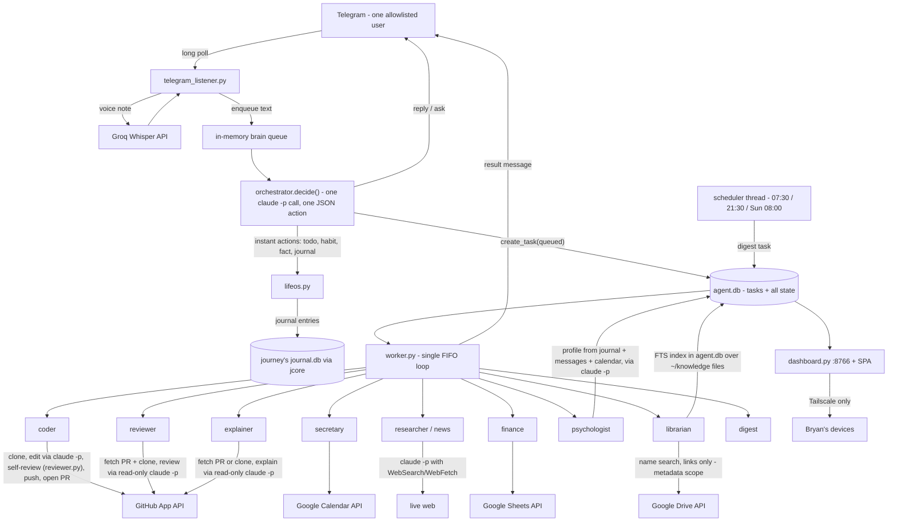

# Architecture

A personal, always-on assistant driven over Telegram, with one user. The box
(GCP free-tier e2-micro, 1 GB RAM) runs **no local inference** — every
"thinking" step shells out to the Claude Code CLI (`claude -p`) on a Claude
Max OAuth token. The 1 GB budget drives the shape: stdlib-first, one SQLite
file, one FIFO worker, outbound-only networking.

The one invariant (ADR-0001): the agent is on 24/7 and reachable from
anywhere with a phone. Everything else is a replaceable means to that end.

## Components

| Component | File(s) | Role |
|---|---|---|
| Listener | `telegram_listener.py` | Entry point / process root. Long-polls Telegram, enforces the one-user allowlist, transcribes voice notes (Groq Whisper), enqueues messages to the in-memory brain queue. Spawns the brain, worker, and scheduler threads. |
| Orchestrator ("brain") | `orchestrator.py` | `decide()` — one tool-less `claude -p` call per message that returns exactly one JSON action. Owns conversation memory (rolling window + facts + rolling summary). Executes instant actions itself; enqueues everything else as a task. |
| Task queue | `task_store.py` | Durable `tasks` table + state machine in `agent.db`. |
| Worker | `worker.py` | Single background FIFO loop: pulls one runnable task, routes it to its role handler, sends the result to Telegram. One at a time, by design. |
| Roles | `coding_agent.py`, `reviewer.py`, `explainer.py`, `secretary.py`, `researcher.py`, `finance.py`, `psychologist.py`, `mailwatch.py`, `librarian.py`, `lifeos.py` (digests) | Specialized handlers run inside the worker. See `docs/subsystems/`. |
| LifeOS layer | `lifeos.py` | Todos / habits / journal ops (instant, no dispatch) + the scheduler thread that enqueues digest tasks at fixed local times. |
| Dashboard | `dashboard.py`, `frontend/` | Stdlib HTTP server on `127.0.0.1:8766` over the same SQLite; serves the pre-built SPA. Reached only via Tailscale. |
| Logging | `agentlog.py` | Timestamped log + `timed()` bracket around every `claude -p` subprocess. |
| MCP server | `mcp_server.py`, `.mcp.json` | The role functions (knowledge, calendar, todos/habits/reminders) as typed tools for Claude Code sessions on the box — the Tier-2 interface (ADR-0010). Session-spawned over stdio, never a daemon. |
| Remote control | `run_remote_control.sh`, `deploy/remote-control.service` | Keeps a `claude remote-control` server up so the claude.ai app creates sessions on the VM directly (phone-first; capacity-limited for the 1 GB box). |
| Staging & setup | `stage.py`, `setup.py`, `envfile.py` | Laptop staging (full orchestrator/worker path, disposable `staging.db`) and the clone-to-running credential wizard (ADR-0009). |
| Deploy | `deploy/` | Pull-based: a 2-min systemd timer on the VM fetches `origin/main`, defers while a task is `running`, else hard-resets, pip-installs if `requirements.txt` changed, and restarts services. `git push origin main` = live in ~2 min. |

## Data flow

## The turn cycle

1. Listener receives a message (≈1 s), validates the sender, enqueues it.
   The poll loop never blocks on the model.
2. The brain thread runs `decide()` (~6–11 s): full context (facts, rolling
   summary, open todos/habits, recent tasks, message window) → one JSON
   action.
3. Instant actions (todos, habits, facts, journal save) execute in-line
   and reply immediately. Dispatchable work becomes a `tasks` row
   (`status='queued'`) and the user gets an acknowledgment.
4. The worker picks up the oldest `queued`/`approved` task, runs the role,
   and sends the result to the chat. A long coder build blocking the queue
   is normal; the user can keep chatting meanwhile.
5. After the reply is sent, the orchestrator folds aged-out messages into
   the rolling summary (a second, non-blocking `claude -p` call).

## Human-in-the-loop gates

- **Coder plan gate** — complex changes return a plan (with 2–6 numbered
  milestones, ADR-0006) and park as `awaiting_approval`; the user's "yes"
  re-queues them as `approved`, and execution then chains one bounded pass
  per milestone with a progress ping after each.
- **Coder clarification gate** — ambiguous tasks return questions and park
  as `awaiting_clarification`; answers are folded into the instruction and
  the task re-queues. This is the *only* way a dispatched task can ask
  follow-ups.
- **PR review** — every coder PR passes an automated self-review gate
  (review → fix blocking findings → re-review, fail-open) before it opens,
  and the coder never merges: a human reviews every PR. The reviewer role
  also reviews any existing PR on demand — advisory only, it never
  merges/approves.
- **Calendar writes** — the orchestrator confirms create/move/cancel with
  the user before dispatching; list is dispatched immediately.
- **Journal save** — the orchestrator proposes the structured entry and
  waits for a "yes" before `journal_save`.

## Concurrency model

Four threads in one process (`telegram_listener.py` is the root):

| Thread | Loop | Why it exists |
|---|---|---|
| Poll loop (main) | Telegram `getUpdates` | Receive + enqueue only; stays responsive. |
| Brain | drains the in-memory queue, sequentially | The ~6–11 s `decide()` must not deafen the poll loop; sequential so conversation order can't scramble. |
| Worker | oldest runnable task, one at a time | Concurrency would blow the 1 GB budget. |
| Scheduler | every 60 s: deliver due reminders, fire due digest jobs | Restart-safe via `sched_runs` (once per job per day); reminders marked sent before sending. |

The brain queue is in-memory by design: a crash loses messages received but
not yet decided. Accepted trade-off for low-stakes chat.

## External services

- **Claude Code CLI** — all reasoning. Every call unsets `ANTHROPIC_API_KEY`
  (Max OAuth token only, never metered API). Brain-style calls are
  `--tools "" --max-turns 1`; the coder and researcher differ deliberately
  (see their subsystem docs).
- **Telegram Bot API** — the only user interface. Outbound polling only.
- **GitHub App** — short-lived installation tokens (`github_app.py`) for the
  coder's clone/push/PR, the reviewer's PR fetch, and the weekly journal
  backup.
- **Google Calendar / Sheets / Drive** — secretary, finance, and the
  librarian's Drive finder (metadata-only scope: names and links, never
  contents — ADR-0007), via a long-lived `token.json` refresh token (no
  browser on the box).
- **Groq Whisper** — voice-note transcription (the one non-Google/GitHub
  external API key).
- **journey** — separate journaling app on the same VM; owns `journal.db`
  and all journaling UI. This repo writes entries through its `jcore`
  module as a client.

## Failure doctrine

Long-running loops never die on a task's exception: catch, log via
`agentlog`, mark the task `failed`, report to Telegram. On startup,
`recover_orphans()` marks tasks left `running` by a crash as `failed`.
Scheduled/digest calls have plain-text fallbacks so a model failure still
produces a message. A `claude [...] -- start` log line with no matching
`-- done` for ~10 min is the alarm signal.

## Further reading

- `docs/data-model.md` — every table, owner, relationships.
- `docs/subsystems/` — per-domain interface docs.
- `docs/adr/` — decisions, starting with ADR-0001 (the invariant).
- `README.md` / `docs/extras/gcp_setup_guide.md` — hosting, ops, deploy mechanics.
